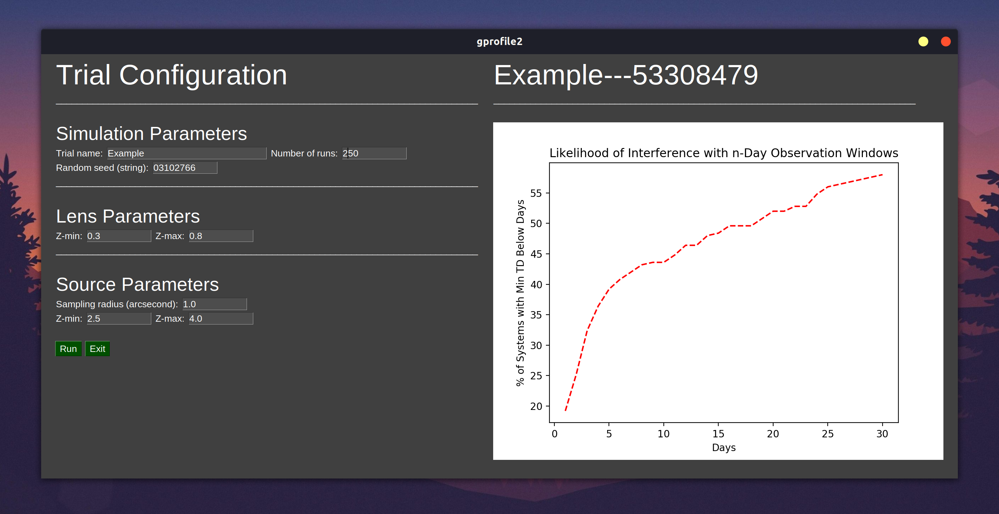

# gprofile2
Statistically characterizes gravitational lensing of gravitational waves

**NOTE: I am currently developing new Python lensing models which will be released soon; these Monte Carlo models are from 2019**

By utilizing the computational methods of glafic, an executable developed by M. Oguri (2010), these scripts can rapidly generate, sample, and analyze a list of galactic lenses over a representative sampling distribution. Galactic lenses are randomly sampled over the SIE lens parameter space outlined in M. Oguri (2018).

A simple GUI is implemented which assists in setting sampling parameters and displaying visualizations. More thorough results and raw data are saved in HDF5 format.

The modular design of each step is intended to make it easy to divide tasks simply across multiple computing processes. Multiple simulations can be run independently, and then combined by merging Pandas DataFrames.

## Screenshots

## Dependencies:
* Python 3 (and pip/conda for package management)
* tkinter (for Python 3)
  * More information at https://docs.python.org/3/library/tkinter.html
  * On Ubuntu, can install with `sudo apt install python3-tk`
* glafic (added to $PATH)
  * Can be downloaded at https://www.slac.stanford.edu/~oguri/glafic/
  * UNIX only (Mac OSX and Linux (64 bit))
  * Binary only; source code cannot be published due to copyright

NOTE: Developed in a UNIX environment (Ubuntu 18.04); untested elsewhere.

## Usage instructions:
1. Clone repository or download and unzip source code for gprofile2
1. Install glafic
1. In bash shell, navigate to gprofile2 master directory
1. Create or activate appropriate Python 3 virtual environment
1. Install required packages using `pip install -r requirements.txt`
1. Install tkinter
1. Run the GUI with 'python run.py'
1. Enter desired simulation parameters (if different from default values)
1. Press 'Run'
1. View summary of results in the window
1. Conduct further analysis as desired with raw data stored as HDF5 format in '.../gprofile2/Results/{trial_name}---{seed}/data.h5'

## KNOWN BUGS:
* When running successive trials in the same window instance, graphs overlap instead of replacing each other

Created by Evan Meade (https://github.com/Evan-Meade, aka. kracken9500), 2019

Research group of Dr. Lindsay King (UTD)
